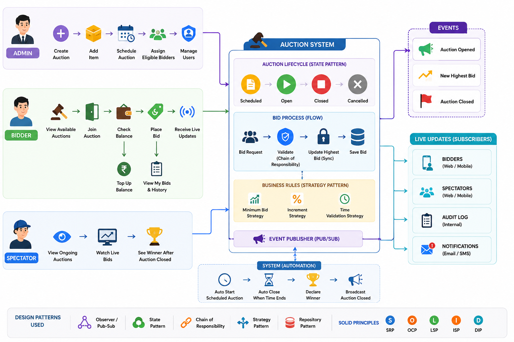
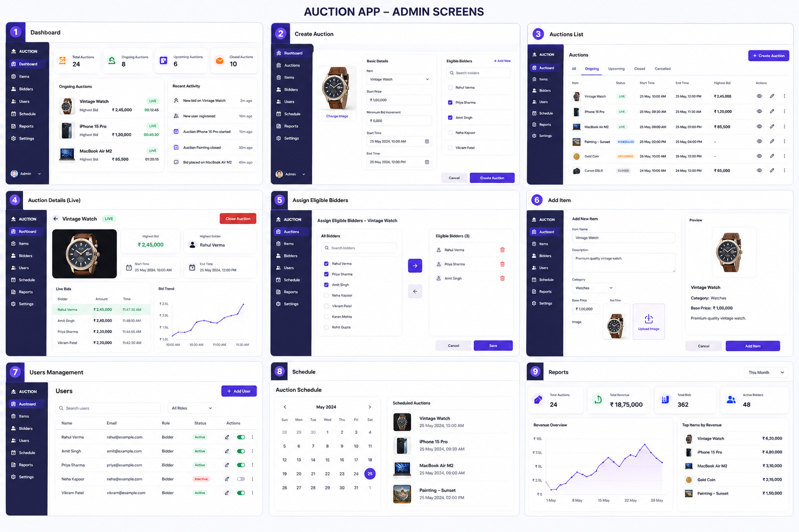
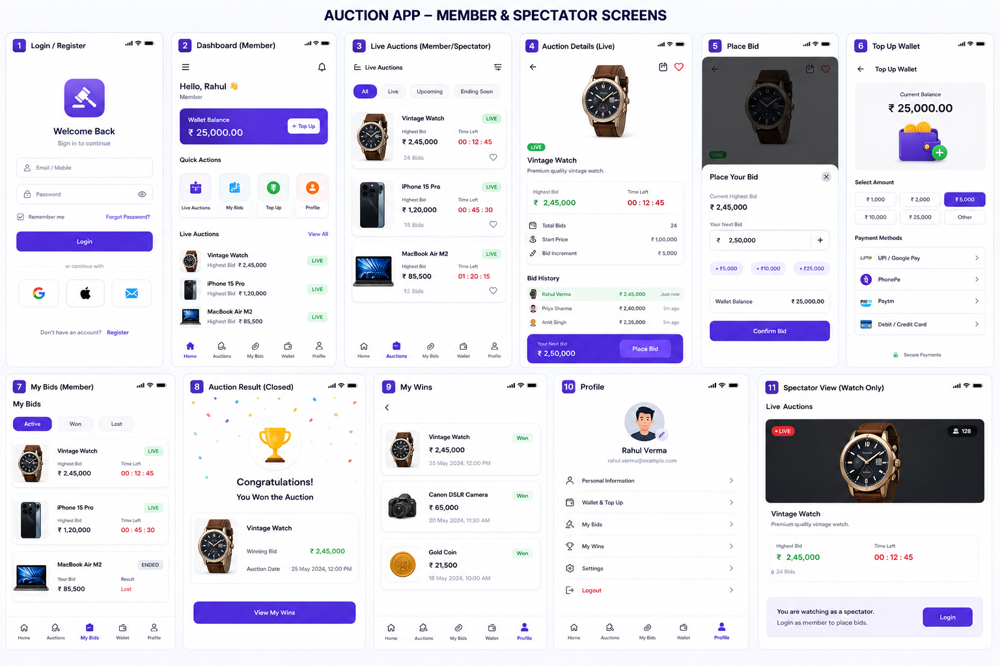

> **Prompt** Good now can you generate the image which showing the flow of the software like which actor have the which operation simply and easy to explain based on the above with minimal text but rich icons for all above operations looking good color ful icon rich 

> **Prompt** Good awsome now can you generate the image having the UI/screens  for actor : admin  showing the above Auction App     covering all above actions please with professional  based simple UI/UX easy to understand and looking good  , minimal text looking good covering all the screens , looking good

> **Prompt**  Good awsome now can you generate the image having the UI/screens  for actor : Member / Spectacle   showing the above Auction App     covering all above actions please with professional  based simple UI/UX easy to understand and looking good  , minimal text looking good covering all the screens , looking good

