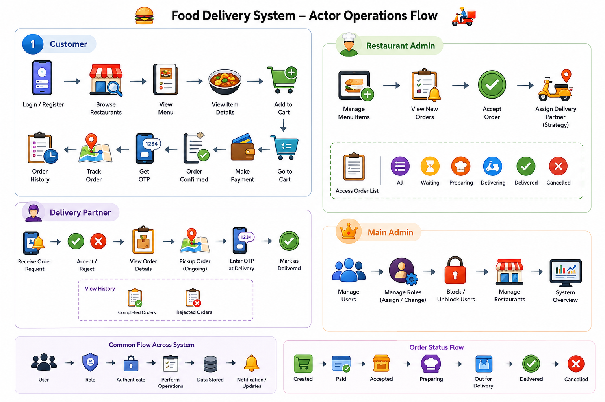
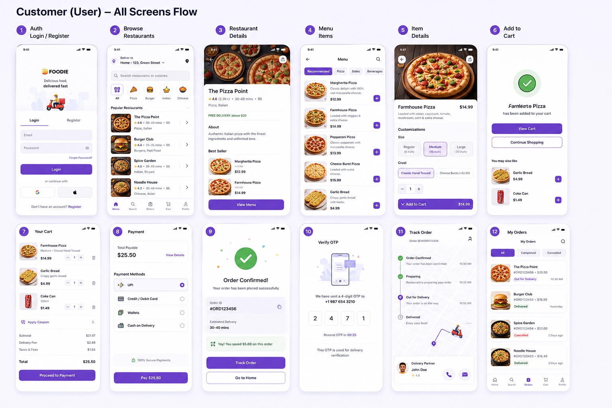
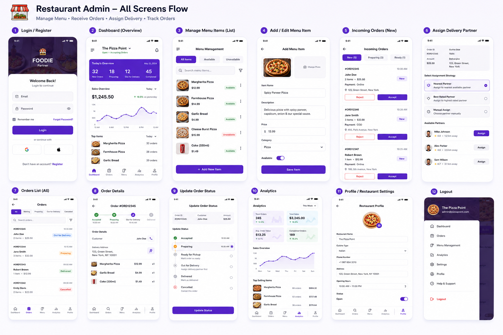
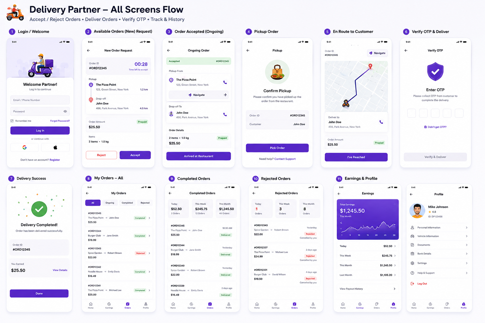
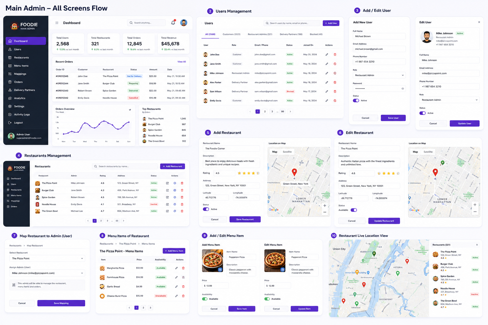

> **Prompt** Good now can you generate the image which showing the flow of the software like which actor have the which operation simply and easy to explain based on the above with minimal text but rich icons for all above operations looking good color ful icon rich 

> **Prompt** Good awsome now can you generate the image having the screens for actor : user  covering all above actions please with preimum ui and professional

> **Prompt** Good awsome now can you generate the image having the screens for actor : restaurent  admin   covering all above actions please with preimum ui and professional

> **Prompt** Good awsome now can you generate the image having the screens for actor : restaurent  delivery partner   covering all above actions please with preimum ui and professional

> **Prompt** Good awsome now can you generate the image having the screens for actor : main admincovering all above actions please with preimum ui and professional

