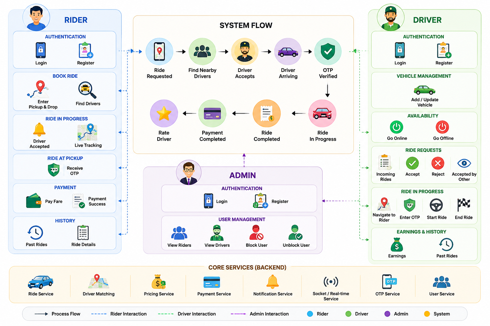
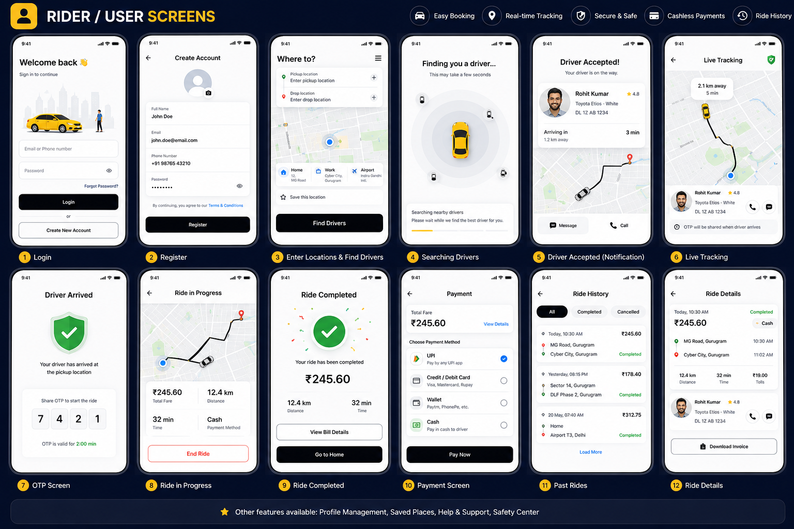
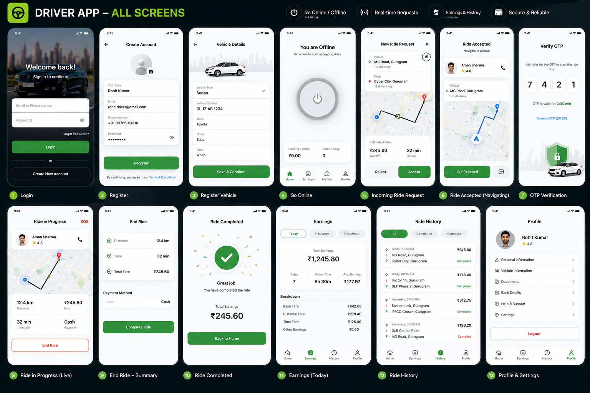

> **Prompt** : Hey hi, I am Learning LLD so during this phase I am in requirement phase means who are actors what operations need to give them , I want to create MVP only so to get high leverage for the learning of LLD and don't wast on normal things so can you guide me regarding this for Uber Cab Booking 

For learning **LLD (Low Level Design)**, your current approach is actually very strong:

* First → understand actors
* Then → understand operations/use-cases
* Then → identify entities/models
* Then → relationships + flows
* Then → APIs/services/classes
* Finally → patterns + scalability

For MVP-focused LLD learning, the biggest leverage comes from learning:

1. **How to identify core business flows**
2. **How to separate responsibilities**
3. **How to avoid over-engineering**
4. **How to model real systems simply**

For an Uber-like cab booking app, don’t try to build:

* surge pricing engine
* live distributed tracking
* route optimization AI
* wallet systems
* microservices
* Kafka/event-driven systems
* real-time socket scaling
* complex maps infra

Those belong to:

* HLD
* distributed systems
* scaling architecture

For MVP LLD learning, focus on:

* clean object responsibilities
* workflows
* state changes
* service boundaries
* extensibility

---

# Step 1 — Think in Actors

For MVP Uber:

## Primary Actors

### Rider

Uber Rider

Operations:

* Register/Login
* Search cab
* Book ride
* Cancel ride
* View ride history
* Pay fare
* Rate driver

---

### Driver

Uber Driver

Operations:

* Register/Login
* Go online/offline
* Accept ride
* Reject ride
* Start trip
* End trip
* View earnings

---

### Admin

Uber Admin

Operations:

* Manage users
* Block driver/rider
* View rides
* Manage pricing rules

---

# Step 2 — Identify CORE MVP Flow

This is the most important part.

For MVP:

## Main Flow

```text
Rider requests cab
    ↓
System finds nearby drivers
    ↓
Driver accepts ride
    ↓
Ride starts
    ↓
Ride completes
    ↓
Payment happens
    ↓
Rating submitted
```

If your LLD supports this flow cleanly,
your MVP design is already GOOD.

Most beginners waste time designing:

* chat systems
* coupon engines
* notifications infra
* recommendation systems

Ignore those initially.

---

# Step 3 — Extract Core Entities

Now derive entities from flow.

---

## Rider

```text
id
name
phone
rating
```

---

## Driver

```text
id
name
vehicle
license
status
currentLocation
rating
```

---

## Vehicle

```text
id
type
numberPlate
model
```

---

## Ride

MOST IMPORTANT ENTITY.

```text
id
riderId
driverId
pickup
drop
status
fare
timestamps
```

Ride status is extremely important.

Possible states:

```text
REQUESTED
DRIVER_ASSIGNED
DRIVER_ARRIVING
IN_PROGRESS
COMPLETED
CANCELLED
```

This is where LLD learning becomes valuable.

---

## Payment

```text
id
rideId
amount
paymentMethod
status
```

---

# Step 4 — Identify Important Services

This is where good LLD starts.

DO NOT make giant God classes.

---

## AuthService

Handles:

* login
* signup
* token/session

---

## RideService

MOST IMPORTANT SERVICE.

Handles:

* create ride
* assign driver
* start ride
* end ride
* cancel ride

---

## DriverMatchingService

Handles:

* find nearby drivers
* assign best driver

Initially:

* nearest driver logic is enough

Later:

* rating
* ETA
* surge
* heatmaps

can evolve.

---

## PricingService

Handles:

* fare calculation

MVP:

```text
baseFare + perKmRate
```

Enough.

---

## PaymentService

Handles:

* payment processing
* payment status

---

# Step 5 — Identify Best LLD Learning Opportunities

For Uber MVP, these are HIGH LEVERAGE:

---

# 1. State Pattern (VERY IMPORTANT)

Ride changes states.

Perfect learning opportunity.

Example:

```text
RequestedState
AssignedState
InProgressState
CompletedState
CancelledState
```

This teaches:

* extensibility
* avoiding giant if-else
* open/closed principle

Very high interview value.

---

# 2. Strategy Pattern

For pricing.

Example:

```text
BikePricingStrategy
MiniPricingStrategy
SUVPricingStrategy
```

Later:

* surge strategy
* premium strategy

---

# 3. Factory Pattern

Vehicle creation.

Example:

```text
VehicleFactory.create(type)
```

---

# 4. Observer Pattern

Optional for MVP.

Useful for:

* notifications
* ride updates

Example:

* rider notified
* driver notified

---

# Step 6 — What NOT To Design Initially

Huge leverage point.

DO NOT design:

* GPS internals
* Google Maps internals
* Kafka
* Redis clustering
* Load balancing
* microservices
* Docker/Kubernetes
* payment gateway internals
* websocket scaling
* ML matching systems

Those are:

* HLD
* System Design
* Distributed Systems

Not MVP LLD.

---

# Step 7 — Ideal MVP Scope

This is enough:

## Rider Features

* login
* book ride
* cancel ride
* pay
* rating

---

## Driver Features

* online/offline
* accept/reject
* start/end ride

---

## Admin Features

* view users
* view rides

---

# Step 8 — Best Learning Order

This order gives maximum leverage.

## Phase 1 — Requirements

Actors + operations

---

## Phase 2 — Core Entities

Ride
Driver
Rider
Vehicle
Payment

---

## Phase 3 — Services

RideService
DriverMatchingService
PricingService

---

## Phase 4 — Design Patterns

State
Strategy
Factory

---

## Phase 5 — APIs

Example:

```text
POST /rides
POST /rides/:id/accept
POST /rides/:id/start
POST /rides/:id/end
```

---

## Phase 6 — DB Schema

Simple relational schema enough.

---

# What Interviewers Actually Look For

Not complexity.

They look for:

* separation of concerns
* extensibility
* clean responsibilities
* proper abstractions
* avoiding tight coupling
* identifying changing behavior

---

# GOLDEN RULE FOR MVP LLD

Ask:

> "What is the CORE business flow?"

Then only design things supporting that flow.

For Uber:

```text
Book Ride → Assign Driver → Complete Ride
```

Everything else is secondary.

That mindset gives extremely high leverage in LLD learning.


> **Prompt** I am thinking actors and actions are like 
Rider : able to login , register (name , email , password)
he can able to from to options search location  and click button find drivers 
he need to notified when driver accepts 
he can see where the driver currently OpenStreetMap using the socket io 
once driver reached he got the OTP 
he can pay the amount after ride complete
he can able to see the past rides 


Driver : able to login and register (name , email , password)
able to register his vehicle details 
able to see the list of rides he can see what distance he go , how much,  from to (real time) 
able to accept or reject and see if any other accepted lively Accepted by other 
after accept he can reach and need to enter otp 
he can see past rides and income 


Admin : 
He can able to login / register like above 
He can manage users riders / drivers block / unblock 

This is how I am thinking what you suggest ? 

Your thinking is actually VERY GOOD for MVP LLD learning.

You are already naturally identifying:

* actors
* use cases
* realtime requirements
* entities
* async communication
* validations
* state transitions

That is exactly how strong LLD thinking starts.

Now I’ll help you refine it into a more professional MVP-focused requirement mindset.

---

# First Important Insight

You are mixing:

* business requirements
* technical implementation

Example:

```text id="3k0pg4"
see current driver using OpenStreetMap using socket io
```

For requirement phase, think:

```text id="u89g8e"
Rider can track driver in real time
```

NOT:

* OpenStreetMap
* Socket.IO

Those belong to:

* technical design
* implementation phase

This distinction is VERY important in interviews and real projects.

---

# Better Requirement Thinking Structure

Use this mental structure:

```text id="84y0rk"
Actor
   ↓
Goals
   ↓
Actions
   ↓
Business Rules
   ↓
Technical Design
```

You are currently mixing Action + Technical Design.

---

# Refined Version of Your Requirements

# Rider

Rider

## Authentication

* Register
* Login
* Logout

Fields:

```text id="j0n65s"
name
email
password
```

---

## Ride Booking

* Search pickup location
* Search destination
* Request ride
* View nearby available drivers

---

## Ride Lifecycle

* Receive notification when driver accepts
* Track driver location in real time
* Receive OTP when driver arrives
* View trip progress

---

## Payment

* Pay after ride completion
* View fare details

---

## History

* View past rides
* View ride details

---

# Driver

Driver

## Authentication

* Register
* Login
* Logout

---

## Vehicle Management

* Add vehicle details
* Update vehicle details

Vehicle fields:

```text id="nhq1tu"
vehicleNumber
vehicleType
model
```

---

## Availability

* Go online
* Go offline

VERY IMPORTANT feature.
Without this, matching becomes messy.

---

## Ride Handling

* View incoming ride requests
* Accept ride
* Reject ride
* View if ride already accepted by another driver

Excellent thinking from you here.

This introduces:

* race conditions
* concurrency

Very valuable LLD learning.

---

## Ride Lifecycle

* Navigate to rider
* Verify OTP
* Start trip
* End trip

---

## Earnings

* View ride history
* View earnings

---

# Admin

Admin

## Authentication

* Register
* Login

---

## User Management

* View riders
* View drivers
* Block/unblock riders
* Block/unblock drivers

---

# VERY IMPORTANT — Add Missing Business Rules

This is where real LLD maturity starts.

---

# 1. Ride States

You should explicitly define them.

Example:

```text id="mjlwmx"
REQUESTED
DRIVER_ASSIGNED
DRIVER_ARRIVING
OTP_VERIFIED
IN_PROGRESS
COMPLETED
CANCELLED
```

This will later become:

* State Pattern
* Enums
* workflow engine

---

# 2. Driver Status

You need this too.

```text id="gfrw2q"
ONLINE
OFFLINE
BUSY
```

Otherwise:

* multiple rides may get assigned
* unavailable drivers appear

---

# 3. OTP Rules

Good MVP feature.

Business rule:

```text id="n0n6oj"
Trip starts only after OTP verification
```

This is a very good real-world flow.

---

# 4. Payment Status

```text id="u6t8v5"
PENDING
PAID
FAILED
```

---

# 5. Ride Acceptance Rule

Critical rule:

```text id="5wp5t2"
First driver accepting gets assigned
```

This introduces:

* locking
* atomic updates
* concurrency handling

VERY valuable learning.

---

# What You Should NOT Add Yet

Avoid:

* wallet
* promo codes
* ride sharing
* chat
* SOS
* subscriptions
* AI pricing
* multi-stop rides
* live traffic optimization

These dilute MVP learning.

---

# Biggest Hidden Learning Opportunities In Your Requirements

Your current requirements naturally introduce:

---

# 1. State Management

Ride states.

High leverage.

---

# 2. Real-Time Systems

Driver location updates.

You’ll learn:

* sockets
* pub/sub mindset
* event updates

---

# 3. Concurrency

Multiple drivers accepting same ride.

Extremely important backend learning.

---

# 4. Authorization

Rider vs Driver vs Admin roles.

---

# 5. Transaction Safety

Payment + ride completion.

---

# 6. Event Driven Thinking

Examples:

```text id="dgm7aa"
RideRequested
RideAccepted
DriverArrived
OTPVerified
RideCompleted
PaymentCompleted
```

This is how scalable systems are mentally modeled.

---

# MVP Suggestion (High Leverage Version)

If your goal is LLD mastery,
I suggest this exact MVP scope:

---

# MUST HAVE

## Rider

* auth
* request ride
* track ride
* OTP
* payment
* history

---

## Driver

* auth
* online/offline
* accept/reject
* OTP verify
* complete ride
* earnings/history

---

## Admin

* block/unblock

---

# OPTIONAL (Good Learning)

* realtime location
* socket updates

---

# SKIP FOR NOW

* maps optimization
* push notification service
* payment gateway integration
* advanced matching

Mock these.

---

# VERY IMPORTANT FINAL ADVICE

For every requirement ask:

```text id="33pav8"
What state changes?
What entity changes?
Who owns this responsibility?
```

Example:

```text id="58smck"
Driver accepts ride
```

Ask:

* Ride state changes?
  → REQUESTED → DRIVER_ASSIGNED

* Driver state changes?
  → ONLINE → BUSY

* Who owns this?
  → RideService

This mindset is EXACTLY what strong backend engineers do.


> **Prompt** I am thinking for the ride status we use state pattern , for the driver status also we use state pattern , for payment , driver allocation we use the stratagy patterns , for real time communication when pub sub like send otp when driver I am thiking like this what you suggest any suggestions from you like design patterns or SOLID principles you can add more and suggest 


Your thinking is moving in a VERY strong backend engineering direction now.

You are no longer just thinking:

> “What features exist?”

Now you are thinking:

* what changes?
* what behavior varies?
* what events happen?
* what should be extensible?

That is the real LLD mindset.

Now let’s refine your pattern choices because some are PERFECT, some are OVERKILL for MVP, and some important ones are still missing.

---

# 1. Ride Status → State Pattern ✅ PERFECT

This is the BEST place for State Pattern.

Example:

```text id="z9zv6e"
RequestedRideState
DriverAssignedState
DriverArrivingState
OtpVerifiedState
InProgressState
CompletedState
CancelledState
```

Why State Pattern fits:

* behavior changes by state
* allowed operations differ
* transitions matter

Example:

```text id="ot2b5s"
REQUESTED
   → canAssignDriver()

IN_PROGRESS
   → cannotCancel()
```

Without state pattern:
huge if-else hell.

So this is excellent.

---

# 2. Driver Status → Maybe State Pattern ⚠️

You CAN use state pattern:

```text id="w6qd8i"
OnlineState
OfflineState
BusyState
```

But for MVP,
this may be OVER-ENGINEERING.

Simple enum may be enough:

```text id="c16jlwm"
ONLINE
OFFLINE
BUSY
```

My suggestion:

## Use:

* State Pattern for Ride
* Enum for Driver Status initially

Later you can evolve.

Reason:
Ride behavior is complex.
Driver status behavior is simple.

This is important engineering judgment.

---

# 3. Payment → Strategy Pattern ✅ GOOD

Excellent choice.

Example:

```text id="82k24n"
CashPaymentStrategy
UPIPaymentStrategy
CardPaymentStrategy
```

This is exactly what Strategy Pattern is for:
changing algorithms/behaviors.

---

# 4. Driver Allocation → Strategy Pattern ✅ VERY GOOD

Very strong design thinking.

Example:

```text id="4hpfh0"
NearestDriverStrategy
HighestRatedDriverStrategy
LeastBusyDriverStrategy
```

This is professional-level extensibility thinking.

---

# 5. Real-Time Communication → Pub/Sub + Observer ✅ VERY GOOD

You are thinking correctly.

Events happen:

```text id="jlwmqv"
RideRequested
RideAccepted
DriverArrived
OtpGenerated
RideCompleted
```

Subscribers react:

```text id="i8n9qv"
NotificationService
SocketGateway
RideTracker
```

This is event-driven thinking.

Excellent direction.

---

# BIGGEST SUGGESTION FROM ME

You are missing one VERY IMPORTANT pattern.

---

# Repository Pattern ✅ VERY IMPORTANT

This is HIGH LEVERAGE for backend LLD.

Example:

```text id="8mqo9g"
RideRepository
DriverRepository
UserRepository
PaymentRepository
```

Why important?

Separates:

* business logic
  from
* database logic

Without repository:

```text id="fyb6pf"
RideService
   ↳ directly writes Mongo queries
```

Bad coupling.

With repository:

```text id="k9j9yx"
RideService
   ↳ RideRepository
```

Now DB can change later.

Very important SOLID practice.

---

# Another Important One

# Factory Pattern ✅

Useful for:

* ride states
* payment strategies
* allocation strategies

Example:

```text id="k58rqw"
PaymentStrategyFactory
DriverAllocationStrategyFactory
RideStateFactory
```

This avoids:

```text id="j3ycq6"
if(type === "UPI")
```

everywhere.

---

# One More VERY Important Pattern

# Adapter Pattern ⚠️ (Later)

When integrating:

* OpenStreetMap
* Payment gateway
* SMS provider

Example:

```text id="1j4v8z"
MapProviderAdapter
PaymentGatewayAdapter
SmsProviderAdapter
```

VERY useful real-world pattern.

But not necessary immediately.

---

# SOLID Principles — Where They Fit

This is the MOST important part.

Patterns are secondary.
SOLID matters more.

---

# S — Single Responsibility Principle

VERY important.

Good:

```text id="p2z62l"
RideService
   → ride business logic

PaymentService
   → payment logic

NotificationService
   → notifications
```

Bad:

```text id="v3f1dn"
RideService
   → payment
   → sockets
   → OTP
   → notifications
   → DB
```

---

# O — Open Closed Principle

Your strategy pattern usage already follows this.

Example:

Add:

```text id="brk5n8"
SurgePricingStrategy
```

without modifying old code.

Excellent.

---

# L — Liskov Substitution

Very useful in strategies/states.

Example:

```text id="7dn02m"
PaymentStrategy
```

Any payment strategy should work interchangeably.

---

# I — Interface Segregation

Avoid giant interfaces.

Bad:

```text id="0y7qbn"
IUserService
   → rider methods
   → admin methods
   → driver methods
```

Better:

```text id="w2zhvd"
IRiderService
IDriverService
IAdminService
```

---

# D — Dependency Inversion ⭐ VERY IMPORTANT

This is BIG.

Depend on abstractions.

Good:

```text id="xfhsh9"
RideService
   → PaymentStrategy interface
```

NOT:

```text id="r4xjlwm"
RideService
   → directly uses UpiPayment
```

This is huge backend maturity.

---

# MOST IMPORTANT ARCHITECTURAL SUGGESTION

You should structure your backend like this:

```text id="m1l88l"
Controller
   ↓
Service
   ↓
Repository
   ↓
Database
```

And side systems:

```text id="1zwn5j"
Socket Gateway
Notification Service
Event Bus
Strategy Layer
State Layer
```

This structure alone teaches huge LLD value.

---

# BEST LEARNING OPPORTUNITIES IN YOUR PROJECT

You accidentally picked a GREAT project.

Because Uber MVP teaches:

| Concept                   | Learning                |
| ------------------------- | ----------------------- |
| State Pattern             | Ride lifecycle          |
| Strategy Pattern          | Matching/payment        |
| Observer/PubSub           | Realtime events         |
| Concurrency               | Multiple driver accepts |
| Repository Pattern        | Clean persistence       |
| SOLID                     | Service separation      |
| Authorization             | Rider/Driver/Admin      |
| WebSockets                | Live tracking           |
| Transactions              | Payment + completion    |
| Event-driven architecture | Notifications           |

This is actually one of the highest leverage LLD projects possible.

---

# One Important Engineering Advice

Do NOT force patterns.

Very common beginner mistake:

```text id="5r4k0k"
Everything → design pattern
```

Bad.

Rule:

```text id="szt6qo"
Use patterns only where behavior changes.
```

Perfect examples:

* pricing changes
* payment changes
* allocation changes
* ride state changes

NOT:

* simple CRUD
* simple enums
* simple DTOs

This judgment is what separates strong engineers from pattern collectors.


> **Prompt** Good now can you generate the image which showing the flow of the software like which actor have the which operation simply and easy to explain based on the above with minimal text but rich icons for all above operations looking good color ful icon rich 



> **Prompt** Good awsome now can you generate the image having the screens for actor : rider or user   covering all above actions please with preimum ui and professional



> **Prompt** Good awsome now can you generate the image having the screens for actor : driver     covering all above actions please with preimum ui and professional




> **Prompt** Good awsome now can you generate the image having the screens for actor : admin covering all above actions please with preimum ui and professional keep simple and follow our discussion


